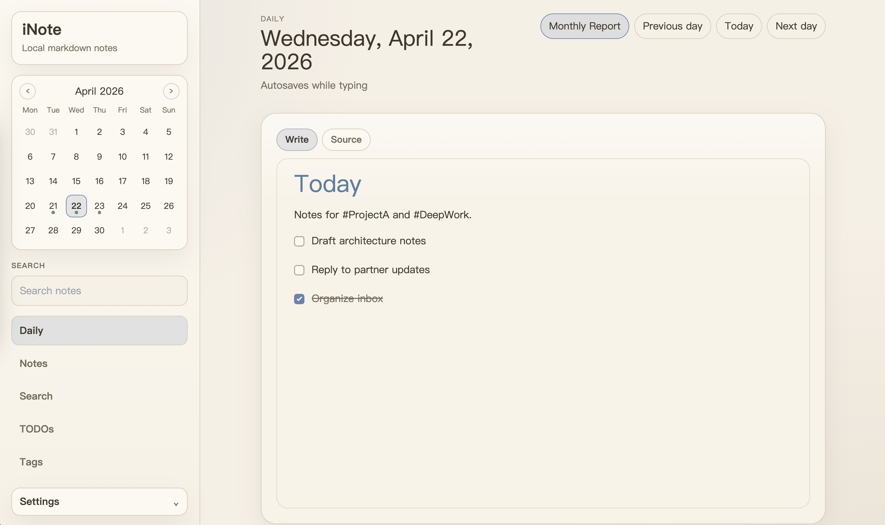

# iNote

Local-first markdown notes for one person, built with Phoenix LiveView and SQLite.

iNote is a small note app that keeps markdown as the source of truth and stays intentionally narrow: daily notes, general notes, fast search, task extraction, and monthly rollups. It is designed for local personal use, with a simple Phoenix + SQLite stack and no account, sync, or collaboration layer.



## Highlights

- Daily notes by date
- General notes with custom titles
- Typora-like markdown editing flow
- Write/source mode toggle
- Inline code and fenced code block support
- Syntax highlighting for code fences
- Full-text search
- TODO filtering from markdown checkboxes
- Monthly report grouped by week from daily note tasks
- Tag browsing from inline hashtags
- Light and dark mode
- Bilingual UI: English and Chinese

## Stack

- Elixir
- Phoenix + LiveView
- SQLite via `ecto_sqlite3`

## Product Boundaries

- No auth
- No sync or cloud features
- No team collaboration
- No scheduling or due-date subsystem

## Pages

- `/` redirects to today's daily note
- `/daily/:date` opens or creates a daily note
- `/notes` lists general notes and creates a new one
- `/notes/:id` opens a general note
- `/reports/monthly/:month` shows a monthly report grouped by week
- `/search` searches across notes
- `/todos` filters checkbox items across notes
- `/tags` browses notes by tag
- `/locale/:locale` switches UI language between `en` and `zh`

## Editor

The editor uses markdown as the persisted format and supports a compact Typora-style writing flow:

- `# ` through `###### ` for headings
- `- `, `1. `, `> ` for lists and blockquotes
- `- [ ] ` and `- [x] ` for task items
- `` `inline code` `` and fenced code blocks with language labels
- Toggle between rich writing mode and raw markdown source mode
- Autosave while typing

This keeps storage and indexing simple while still feeling close to a rich editor when you write.

## Quick Start

Prerequisites:

- Elixir / Erlang
- Node.js

Install dependencies, create the database, and build assets:

```bash
make setup
```

`make setup`, `make assets`, and `make release` now install `assets/package.json` dependencies automatically.

Run the app:

```bash
make run
```

Then open `http://localhost:4000`.

## Common Commands

```bash
make test
make assets
make reset
```

## Release

Build a production release on macOS:

```bash
make release
```

The release tarball is generated at:

```bash
_build/prod/i_note-0.1.0.tar.gz
```

After extracting it on the server, you can use:

```bash
bin/migrate
bin/server
```

`bin/server` starts Phoenix with `INOTE_SERVER=true`. `bin/migrate` runs all pending Ecto migrations inside the release.

Publish the macOS release tarball to GitHub Releases:

```bash
git tag v0.1.0
git push origin v0.1.0
gh release create v0.1.0 _build/prod/i_note-0.1.0.tar.gz \
  --title "iNote v0.1.0"
```

Adjust the version in the commands above to match `mix.exs`.

## Production Database

`prod` uses SQLite and reads the database file path from `INOTE_DATABASE_PATH`.

Example:

```bash
export INOTE_DATABASE_PATH=/var/lib/i_note/i_note.db
export INOTE_SECRET_KEY_BASE="$(mix phx.gen.secret)"
export INOTE_HOST=notes.example.com
export INOTE_PORT=4000
export INOTE_POOL_SIZE=5
```

Practical deployment notes:

- `INOTE_DATABASE_PATH` should point to a persistent writable file on the server.
- The parent directory must exist before the app starts, for example `/var/lib/i_note`.
- Run `bin/migrate` once before the first `bin/server`.
- If you put Phoenix behind Nginx or Caddy, keeping `INOTE_PORT=4000` is enough.

## Notes

- TODO and tag indexes are rebuilt on note save. This is intentional and keeps the implementation simple for local personal use.
- SQLite FTS5 works well for local search, but Chinese tokenization is still basic.
- The app intentionally prefers a small markdown command set over a larger rich-text toolbar.
